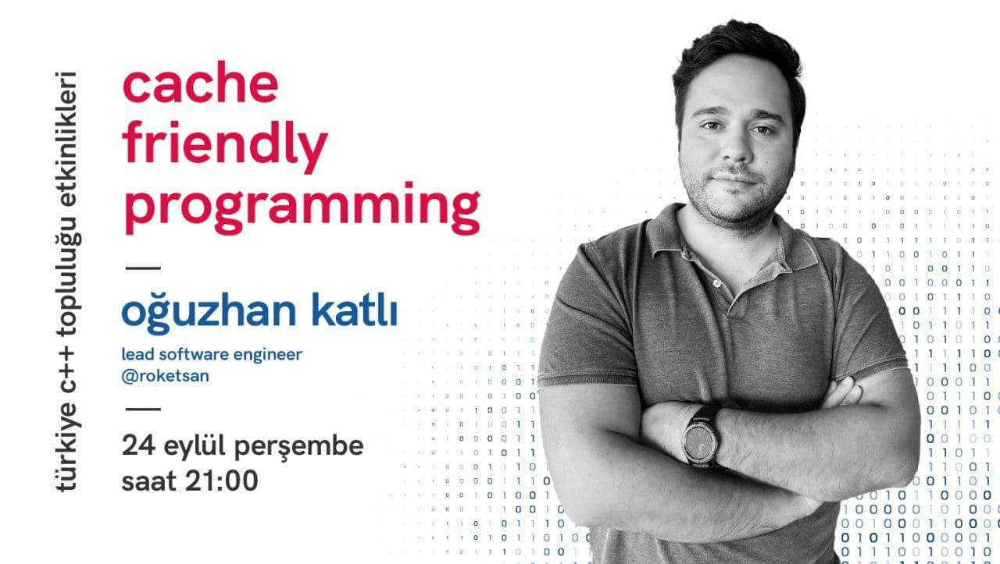

C++ Türkiye topluluğu olarak ilk etkinliğimizi **24 Eylül Perşembe günü saat
21:00'da** YouTube üzerinden canlı olarak yapacağız. "Cache Friendly Programming"
sunumu bütün yazılım dilleri için geçerli olan optimizasyon tekniklerini
içermektedir; bu nedenle her dilden yazılım geliştiren arkadaşlarımızı bu fark
yaratacak etkinliğimize bekliyoruz.

[video](https://www.youtube.com/watch?v=g5PuceJKMak&ab_channel=TurkeyCpp) | [sunum](https://github.com/trcpp/Presentations/tree/master/Cache_Friendly_Programming)

Sunuma dair merak ettiğiniz bütün konuları Slack #cache-friendly-programming
kanalında konuşabilirsiniz. Etkinlik gününe kadar sn Oğuzhan Katlı bütün merak
ettiklerinizi cevaplayacak ve kanalımız etkinlik sonrasında da bir süre devam
ederek sizlerin hizmetinde kalacaktır.