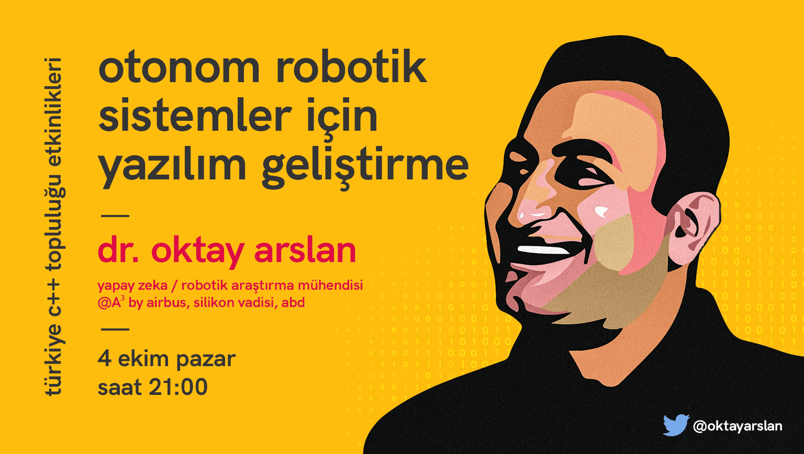

<iframe width="560" height="315" src="https://www.youtube.com/embed/N0nJOltQU7w" frameborder="0" allow="accelerometer; autoplay; clipboard-write; encrypted-media; gyroscope; picture-in-picture" allowfullscreen></iframe>

Türkiye C++ Topluluğu olarak hazırlamış olduğumuz etkinliğimize tekrardan hepiniz hoşgeldiniz.
Bu etkinliğimizde sayın Oktay Arslan ile beraber "Otonom Robotik Sistemler İçin Yazılım Geliştirme" üzerine konuştuk.

- Slack #otonom-yazılım-geliştirme: https://trcpp.slack.com/archives/C01BXRRPZ28

